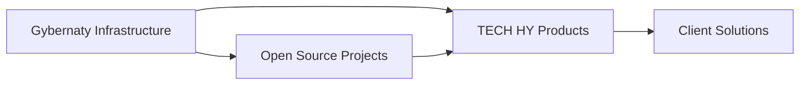

# 🤝 Gybernaty & TECH HY Partnership

> **Стратегическое партнерство между Gybernaty Community и TECH HY Venture Club**  
> Децентрализованная экосистема для AI+Web3+Venture инноваций

[](https://opensource.org/licenses/GPL-3.0)
[](https://github.com)
[](https://github.com)

---

## 📋 Оглавление

- [О партнерстве](#-о-партнерстве)
- [Быстрый старт](#-быстрый-старт)
- [Структура документации](#-структура-документации)
- [Ключевые проекты](#-ключевые-проекты)
- [Интеграция](#-интеграция)
- [Метрики](#-метрики)
- [Ресурсы](#-ресурсы)
- [Контрибьютинг](#-контрибьютинг)
- [Лицензия](#-лицензия)

---

## 🎯 О партнерстве

**Gybernaty** — это живое сообщество исследователей и разработчиков, которые объединились для реализации новой формы кооперации. **TECH HY Venture Club** — AI+Web3+Venture экосистема, помогающая стартапам масштабироваться через технологии, знания и коммьюнити.

**Вместе мы создаем:**
- 🚀 **Технологическую инфраструктуру** — open source решения для AI, Web3, омничейн
- 📚 **Образовательную платформу** — медиа, контент, коммьюнити для фаундеров
- 💡 **Продуктовую экосистему** — готовые решения и интеграции
- 🌐 **Доступ к институциональному Web3** — через Canton Network

### Почему это важно?

В эпоху, когда AI и Web3 становятся критическими для конкурентного преимущества, стартапы сталкиваются с фундаментальной дилеммой: **как масштабироваться быстро, не тратя годы и миллионы на построение инфраструктуры с нуля?**

#### Вызовы современного tech-стартапа

**Технологический долг vs скорость выхода на рынок:**
- Построение AI/Web3 инфраструктуры требует 12-24 месяцев разработки и $500K-$2M инвестиций
- Большинство стартапов не могут позволить себе такую задержку в конкурентной среде
- Даже при наличии ресурсов — риск построить "велосипед", который уже существует в open source

**Фрагментация знаний:**
- Информация о AI, Web3, институциональных блокчейнах разбросана по тысячам источников
- Нет единой точки входа для фаундеров, ищущих практические решения
- Gap между теоретическими знаниями и реальным внедрением

**Изоляция vs экосистема:**
- Стартапы работают в вакууме, без доступа к экспертизе и коммьюнити
- Нет платформы для обмена опытом, поиска партнеров, доступа к инвесторам
- Отсутствие связи между технологическими решениями и бизнес-применением

#### Наше решение: экосистемный подход

**Gybernaty** решает технологическую проблему:
- ✅ Готовая open source инфраструктура (LQD, SAPP, DSP, Contact) — экономия 12-24 месяцев разработки
- ✅ Модульная архитектура — интеграция за недели, а не месяцы
- ✅ Постоянное развитие через сообщество — всегда актуальные технологии
- ✅ Прозрачность кода — можно проверить, улучшить, кастомизировать

**TECH HY** решает проблему знаний и коммьюнити:
- ✅ Структурированная образовательная платформа (Substack, X Spaces, подкасты)
- ✅ Практические кейсы и гайды — от теории к внедрению
- ✅ Активное коммьюнити фаундеров, инвесторов, экспертов
- ✅ Доступ к институциональному Web3 через Canton Network

**Вместе** — это не просто партнерство, а **новая модель экосистемного роста**, где:
- Технологии доступны через open source, а не через дорогие лицензии
- Знания структурированы и применимы, а не разрознены
- Коммьюнити активно помогает, а не просто наблюдает
- Интеграция занимает дни, а не годы

**Результат:** Стартапы получают доступ к enterprise-level технологиям и экспертизе, которые раньше были доступны только крупным корпорациям, но с гибкостью и скоростью стартапа.

---

## 🚀 Быстрый старт

### Для разработчиков

```bash
# Клонировать репозиторий
git clone https://github.com/[username]/gybernaty_techhy_partnership.git
cd gybernaty_techhy_partnership

# Изучить документацию
open GYBERNATY_PARTNERSHIP_DETAILS.md
open MARKETING_STRATEGY_V2.md
```

### Для бизнеса

1. Изучите [EXECUTIVE_SUMMARY_QUICK_START.md](./EXECUTIVE_SUMMARY_QUICK_START.md)
2. Ознакомьтесь с [30_DAY_ACTION_PLAN.md](./30_DAY_ACTION_PLAN.md)
3. Изучите проекты Gybernaty в [GYBERNATY_PARTNERSHIP_DETAILS.md](./GYBERNATY_PARTNERSHIP_DETAILS.md)

### Для маркетологов

1. Изучите [MARKETING_STRATEGY_V2.md](./MARKETING_STRATEGY_V2.md)
2. Используйте [Implementation Guides](./IMPLEMENTATION_GUIDES/)
3. Применяйте [Templates & Checklists](./TEMPLATES_AND_CHECKLISTS/)

---

## 📚 Структура документации

```
gybernaty_techhy_partnership/
├── README.md                          # Этот файл
├── EXECUTIVE_SUMMARY_QUICK_START.md   # Краткий обзор для быстрого старта
├── 30_DAY_ACTION_PLAN.md              # План действий на первые 30 дней
├── MARKETING_STRATEGY_V2.md           # Полная маркетинговая стратегия
├── GYBERNATY_PARTNERSHIP_DETAILS.md   # Детали партнерства с Gybernaty
├── MARKETING_DIRECTOR_AGENT_PROMPT_V2.md  # Промпт для AI-агента CMO
├── README_MARKETING_STRATEGY_V2.md    # Руководство по использованию
├── RESEARCH_PLAN_FOR_MARKETING_STRATEGY_V2.md  # План исследований
├── STATUS_READY_FOR_IMPLEMENTATION.md # Статус готовности
│
├── IMPLEMENTATION_GUIDES/             # Руководства по реализации
│   ├── CONTENT_PRODUCTION_GUIDE.md
│   ├── COMMUNITY_MANAGEMENT_GUIDE.md
│   ├── CHANNEL_OPTIMIZATION_GUIDE.md
│   └── ANALYTICS_SETUP_GUIDE.md
│
├── TEMPLATES_AND_CHECKLISTS/          # Шаблоны и чеклисты
│   ├── CONTENT_TEMPLATES.md
│   └── PROCESS_CHECKLISTS.md
│
└── TECHHY_STRATEGIC_DOC.md            # Исходный стратегический документ
```

---

## 🔬 Ключевые проекты

### Gybernaty Projects

| Проект | Описание | Применение в TECH HY |
|--------|----------|---------------------|
| **LQD** | AI-Assets-Manager для управления криптоактивами | Интеграция в Growth-пакеты, демонстрация AI |
| **SAPP** | Безопасный децентрализованный мессенджер | Коммьюнити коммуникации, защищенные каналы |
| **DSP** | Decentralized Social Platform | Платформа для TECH HY коммьюнити |
| **Contact** | Telegram Social Network | Расширение Telegram функциональности |

### TECH HY Products

- **AI Content Factory** — автоматизация контента через Gybernaty
- **Substack Media Platform** — центральная медиа-платформа
- **X Spaces & Podcasts** — коммьюнити и экспертность
- **Growth Packages** — пакеты для стартапов
- **Canton Network Integration** — доступ к институциональному Web3

---

## 🔗 Интеграция

### Техническая интеграция



### Маркетинговая интеграция

1. **Content Strategy** — демонстрация проектов Gybernaty в контенте
2. **Product Marketing** — интеграция в продуктовые офферы
3. **Community Strategy** — использование SAPP, DSP, Contact
4. **Technology Differentiation** — позиционирование через open source

---

## 📊 Метрики

### Технологические KPI

- Количество интеграций с проектами Gybernaty
- Количество клиентов, использующих проекты
- Количество участников TECH HY в разработке

### Бизнес-метрики

- Выручка от продуктов на базе Gybernaty
- Лиды через демонстрацию проектов
- ROI от интеграций

### Коммьюнити метрики

- Активность в проектах Gybernaty
- Количество контрибьютов в open source
- Рост коммьюнити TECH HY

---

## 📖 Ресурсы

### Документация

- **Gybernaty Docs:** [docs.gyber.org](https://docs.gyber.org/en/home)
- **TECH HY Strategy:** [MARKETING_STRATEGY_V2.md](./MARKETING_STRATEGY_V2.md)
- **Partnership Details:** [GYBERNATY_PARTNERSHIP_DETAILS.md](./GYBERNATY_PARTNERSHIP_DETAILS.md)

### Ключевые концепции

- **Cybersocial Corporation** — новая форма социально-экономического взаимодействия
- **DAO** — децентрализованная автономная организация
- **Open Source** — открытый исходный код
- **Modular Architecture** — модульная архитектура

### Связанные проекты

- [Gybernaty Community](https://docs.gyber.org)
- [Canton Network](https://www.canton.network)
- TECH HY Venture Club

---

## 🤝 Контрибьютинг

Мы приветствуем вклад в развитие партнерства!

### Как внести вклад

1. **Fork** репозиторий
2. Создайте **feature branch** (`git checkout -b feature/amazing-feature`)
3. **Commit** изменения (`git commit -m 'Add amazing feature'`)
4. **Push** в branch (`git push origin feature/amazing-feature`)
5. Откройте **Pull Request**

### Guidelines

- Следуйте структуре документации
- Используйте markdown best practices
- Добавляйте примеры и кейсы
- Обновляйте метрики актуальными данными

---

## 📝 Лицензия

Этот проект использует лицензию **GPL-3.0** (GNU General Public License v3.0).

См. [LICENSE](./LICENSE) для деталей.

---

## 👥 Команда

### Gybernaty Community
- Децентрализованное сообщество исследователей и разработчиков
- [Документация](https://docs.gyber.org)

### TECH HY Venture Club
- AI+Web3+Venture экосистема
- [Стратегия](./MARKETING_STRATEGY_V2.md)

---

## 📞 Контакты

- **Gybernaty:** [docs.gyber.org](https://docs.gyber.org)
- **TECH HY:** См. документацию в репозитории

---

## 🗺️ Roadmap

### Q1 2025: Foundation
- ✅ Документация партнерства
- ✅ Маркетинговая стратегия V2
- 🔄 Интеграция первых проектов

### Q2 2025: Growth
- 📅 Масштабирование интеграций
- 📅 Развитие коммьюнити
- 📅 Первые кейсы

### Q3-Q4 2025: Scale
- 📅 Глубокая интеграция экосистем
- 📅 Совместные продукты
- 📅 Расширение партнерства

---

## ⭐ Статус проекта


**Текущий статус:** ✅ Готово к реализации

---

<div align="center">

**Сделано с ❤️ сообществами Gybernaty и TECH HY**

[⬆ Наверх](#-gybernaty--tech-hy-partnership)

</div>
